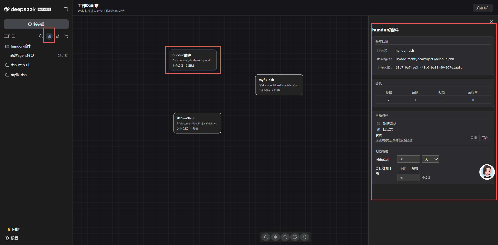
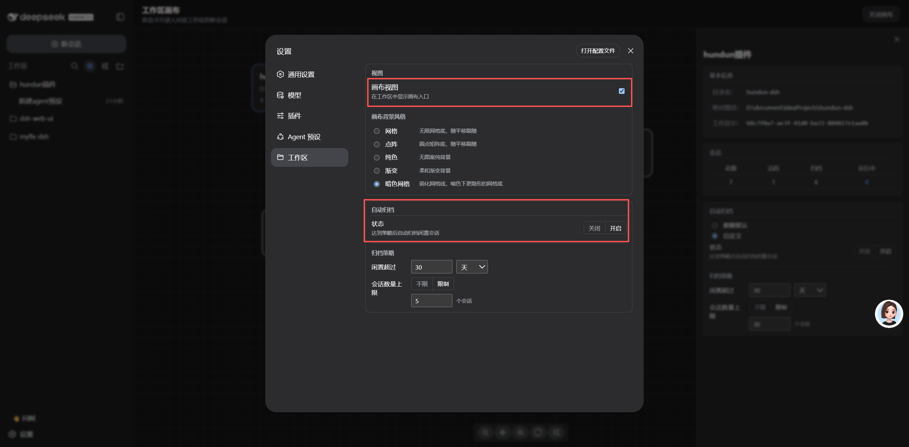

# hundun-dsh

**hundun-dsh** 是 [DeepSeek Harness](https://github.com/deepseek-ai/deepseek-harness)（DSH）Web GUI 的开源插件集合，也是 **hundun 开源系列的第一个项目**。

每个插件都是一个符合 DSH 官方标准、可独立安装的 npm 包（宿主半区 + 浏览器半区），聚合包 `dsh-all` 一键装配全部插件。当前主打 **工作区画布**——把散落在侧边栏的工作区渲染成一张可视化的画布。

## 特性

### 🎨 工作区画布（dsh-workspace-canvas）

- **画布视图**：侧边栏工作区搜索框内一键打开，中间区域自动渲染全部工作区（标题 / 路径 / 会话数），每个工作区一张卡片
- **自由编排**：卡片可拖拽定位、缩放平移、无限网格底，布局自动持久化
- **多种背景风格**：网格 / 点阵 / 纯色 / 渐变 / 暗色网格，设置页或画布操作栏随时切换
- **详情框**：点击卡片弹出三区卡片式详情——身份（大字号名称 + 活跃状态）、基本信息（目录 / 路径 / 工作区 ID）、会话数量（总数 / 活跃 / 归档 / 运行中）；工作区 ID 可一键复制
- **双击进入**：双击卡片直接打开该工作区的新会话

### ⚙️ 设置页（dsh-workspace-canvas 自持）

- 画布设置页（`settings.section`「workspace-canvas」）：启用开关 / 背景风格 / 自动归档，分组展示；设置归功能插件自持，不再依赖聚合包骨架

### 🗄️ 会话自动归档（dsh-workspace-canvas）

- **双条件触发**：会话闲置超期（距上次活跃超过设定时长）或未归档会话数超上限，任一满足即自动归档；超限时按最旧优先归档差额
- **可调阈值**：闲置时长支持 天 / 小时 / 分钟；未归档数上限可设（`0` = 不限制）
- **安全默认**：默认关闭（不静默改动会话）；内置默认 30 天 / 上限 30 个会话
- **配置层级**：工作区自定义 > 全局默认；设置页「workspace-canvas」归档分组设全局默认，工作区详情框归档区可单独覆盖
- **智能跳过**：运行中的会话、无时间戳的会话不参与判定；已归档不重复处理（幂等）
- **归档语义**：归档后从分组界面隐藏，会话日志与账目保留（官方 `archiveSession`，可随时恢复）；画布计数即时同步

## 截图

**工作区画布视图**：侧边栏搜索框一键打开，全部工作区渲染为可拖拽卡片，支持缩放 / 平移与背景风格切换。



**画布设置页**：启用开关 / 背景风格 / 自动归档，分组展示（`settings.section`「workspace-canvas」）。



## 快速开始（开发）

```bash
pnpm install
pnpm -r build        # 各插件 tsc 类型产物 + tsdown 双半区 bundle
pnpm -r typecheck
pnpm -r test
node scripts/aggregate.mjs --check   # 校验聚合补丁与依赖未漂移
```

## 安装到 DSH

插件经 `dsh.bundle.patch`（`cordis.patch.yml`）注入 DSH profile 组合。两种方式：

- **单个插件**：

  ```bash
  dsh plugin --profile <name> add link:<repo>/packages/dsh-workspace-canvas
  ```

- **聚合一键**：把 `@hundun/dsh-all` 装入 profile 树，其 patch 自动插入全部子插件行

重启 `dsh web` 后：

1. 侧边栏工作区搜索行出现画布入口按钮；
2. 点击 → 中间区域切换为画布，自动渲染全部工作区；
3. 点击卡片 → 查看详情；双击卡片 → 进入该工作区的新会话；
4. 点击侧边栏会话/工作区行或「关闭画布」→ 退出画布。

## 插件目录

| 包 | 说明 |
| --- | --- |
| `@hundun/dsh-workspace-canvas` | 工作区画布视图（本仓库主插件） |
| `@hundun/dsh-all` | 聚合载包：一键装配全部插件（设置页由各功能插件自持） |

## 开发

### 结构

```
hundun-dsh/
├── package.json            # 根：workspace 脚本（build / test / typecheck / aggregate）
├── pnpm-workspace.yaml     # shared + packages/*
├── shared/                 # 共享构建预设（客户端 bundle 的 tsdown preset，全仓唯一事实源）
├── scripts/
│   ├── aggregate.mjs       # 聚合补丁生成器：aggregate.yml → cordis.patch.yml + workspace 依赖
│   └── plugin-new.mjs      # 新插件脚手架：templates/plugin → packages/dsh-<name>
├── templates/plugin/       # 插件包模板（宿主工具 + 客户端槽位 UI 的完整最小示例）
└── packages/
    ├── dsh-workspace-canvas/  # 工作区画布
    └── dsh-all/               # 聚合载包
```

### 新增一个插件

```bash
node scripts/plugin-new.mjs my-feature --description "一句话说明"
# 生成 packages/dsh-my-feature：宿主 + 客户端的完整可构建骨架
pnpm install
node scripts/aggregate.mjs   # 把新插件并入聚合包 dsh-all
```

### 约定

- **包命名**：`@hundun/dsh-<name>`，目录 `packages/dsh-<name>`；插件行 id 用 `hundun-<name>`。
- **双半区**：`src/index.ts`（宿主，Node 进程）+ `src/client/index.ts`（浏览器，Web GUI）。
- **SDK 依赖**：`@deepseek-ai/*` 一律为 devDependency + 构建 external，运行时由 DSH profile 树解析，不随包发布。
- **生成文件勿手改**：`packages/*/cordis.patch.yml` 与聚合包 dependencies 由 `scripts/aggregate.mjs` 生成，改 `aggregate.yml` 后重跑。
- **客户端 bundle 纯度**：浏览器半区只能 import 平台模块与内联安全层；跨插件协作走 cordis 服务。
- **测试**：每个包 vitest（jsdom）覆盖运行时行为，改动必须带测试。

## Roadmap

hundun 开源系列规划：

- [x] step.1 **· hundun-dsh**：工作区管理(画布视图、会话自动归档) + 聚合插件框架（本仓库）
- [ ] step.2 hundun生态： agent presets/ agent instance / task / chanel/ 跨插件注册&扩展
- [ ] step.3 更多工作流插件：画布编排的配套工具

## 许可

Apache-2.0（见 [LICENSE](./LICENSE)）。（Apache-2.0，其源出 DeepSeek Harness 官方 client 构建），派生声明见 LICENSE。
